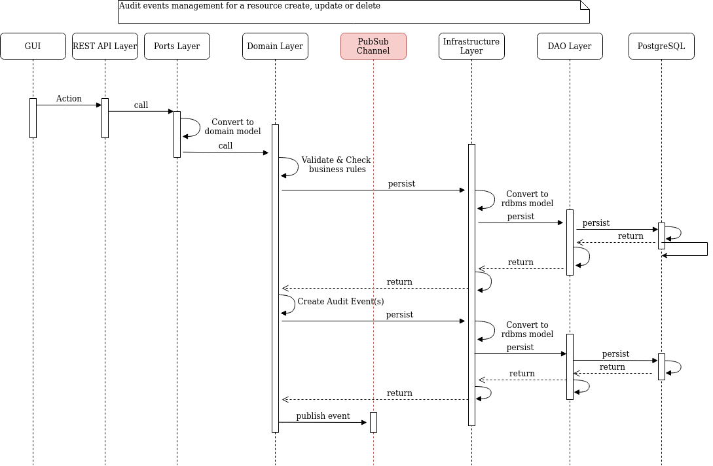
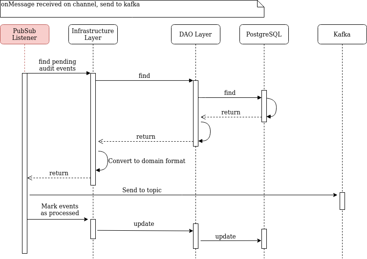

# orm-usm

Organizations &amp; Users Management

[Multi-tenant](https://en.wikipedia.org/wiki/Multitenancy) designed spring-boot application for users management.

A multi-tenants software architecture aims at serving multiple organizations.

Code is organized in a "domain driven" way where:

- "ports" interfaces REST apis and Domain business layer, basically converting from REST DTO format to
  domain entities format.
- "domain" layer contains all business rules and is agnostic either from REST format and to underlying storage layer
- "infrastucture" layer ensures format conversion between domain and the persistence layer

## Technical stack

Standard REST application relying on:

- Sprint boot (3.2.x)
- PostgreSQL (16.x) for persistence
- Liquibase for rdbms schema versions management
- Spring boot JDBC for persistence (No f**\*\*** ORM)
- Spring integration for PublishSubscribe channel
- HikariCP for connection pooling
- Kafka stack (Kafka + Zookeeper + Schema registry + AKHQ)
- Testcontainers and Mockito for unit testing (docker containers like postgreSQL)

## Docker

Docker compose file: docker/docker-services.yml

`docker-compose -f docker/docker-services.yml up -d`

Services:

| Service         | Version | Port |
| --------------- | ------- | ---- |
| postgreSQL      | 16.1    | 5432 |
| akhq            | 0.24.0  | 8086 |
| zookeeper       | 7.4.3   | 2181 |
| kafka           | 7.4.3   | 9092 |
| schema-registry | 7.4.3   | 8085 |

**Database setup**:

Database schema management relies on liquibase, to setup:

1. Connect to postgreSQL container and execute db_accounts_setup.sql which:

- Creates database
- Creates accounts:
  - tec_orm_usm_dba: database account with DDL authorizations (Data Definition Language)
  - tec_orm_usm_app: database account with only DML authorizations (Data Modeling Language). This account is used by spring boot application since applicative accounts must not have thr rights to alter database schema

2. Package project

```java
mvn clean package install -DskipTests
```

3. Move to db-migration/target folder

4. Perform Liquibase update:

```java
java -jar db-migration.jar --classpath=db-migration.jar --driver=org.postgresql.Driver --url="jdbc:postgresql://localhost:5432/orm_usm" --changeLogFile="postgresql/changelogs.xml" --username=tec_orm_usm_dba --password=tec_orm_usm_dba --logLevel=info  update
```

## Entities

- **Tenant**:
  - A tenant aims at serving multiple organizations.
  - Properties:
    - id: internal identifier
    - uid: external identifier (UUID)
    - code: functional code (unique)
    - label: tenant's label
- **Organization**:
  - An organization belongs to a tenant and holds users
  - Properties:
    - id: internal identifier
    - uid: external identifier (UUID)
    - tenant: Refererce on tenant
    - label: Organization's label
    - code: functional code (unique)
    - kind: Organization's code (Enumeration: TENANT,BU,COMMUNITY,ENTERPRISE)
    - country: Country code (ISO 3166-1 Alpha2)
    - status: status (Enumeration: DRAFT, ACTIVE, INACTIVE)
- **User**:
  - A user belongs to an organization and thus to a tenant
  - Properties:
    - id: internal identifier
    - uid: external identifier (UUID)
    - tenant_id: Reference on tenant
    - org_id: Reference on organization
    - login: User login (unique)
    - firstName: First name
    - lastName: Last name
    - middleName: Middle name
    - email: Email address
    - status: (Enumeration: DRAFT, ACTIVE, INACTIVE)
- **Events**:
  - Storage of audit events.
  - An audit event is always recorded when an entity is created (tenant, organization, sector), updated or deleted
  - Properties:
    - uid: A uique identifier (uuid)
    - created_at: Creation timestamp (UTC/ISO-8601)
    - last_updated_at: Last update timestamp (UTC/ISO-8601)
    - target: Entity type (Enumeration: Tenant(0), Organization(1), User(2), Sector(3))
    - object_uid: Entity object uid
    - action: Enumeration: CREATE, UPDATE, DELETE
    - status: Event status (Enumeration: PENDING(0), PROCESSED(1), FAILED(2))
    - payload: Audit event in json format (PostgreSQL jsonb)

## Audit events

Everytime an entity (tenant, organization, user, sector) is created, updated or deleted, an audit event is persisted in rdbms.

**Why persisting audit events in rdbms and not sending event directly to kafka ?**

When talking about audit events, we must ensure audit events and underlying data in rdbms are **consistent**.

Indeed, we want to avoid the following two use cases:

- A rollback is performed in rdbms and the event is still sent and thus the audit event does not reflect the underlying data.
- For some reasons, the kafka brokers are not reacheable (network failure for example). In this case, either transation is rollback if message sending is within the same transactional method or message is not sent at all to kafka if outside transactiona method.

Thus, to ensure consistency between data stored in rdbms and audit event, these ones are stored in rdbms in the same transaction than the data. Obvisouly, we're here relying on ACID features of potgreSQL relational database.
In other words, if a transaction rollback occurs, both data and audit events are rollbacked.



Schema above describes this behaviour, the audit event is created in the same transaction than data.
Once audit events and data have been persisted, a "wakeup" message is sent to a spring-integration PublishSubscribe channel

```java
eventAuditChannel.send(MessageBuilder.withPayload(KafkaConfig.AUDIT_WAKE_UP).build());
```

Listener "eventAuditChannel" responsibilities are:

- Retrieve "pending" events from rdbms
- Push events to kafka
- Mark events are processed



## Testing REST APIS

An [Insomnia](https://insomnia.rest/) collection is available in docs directory.

## Debugging HTTP requests

A particular HTTP filter (see: LogHttpFilter class in webapi module) has been designed to be able to debug a single HTTP request.

Indeed, the problem with changing level mode of loggers is that all incoming traffic is debugged.

To avoid this, since it's a classic REST API, one HTTP request => One thread.

Thus, a ThreadLocal (LogHttpUtils.APP_LOG_CTX) can be used to position a debug flag depending on the presence or absence of an HTTP header in request.

This custom header is customizable in application.yml (Defaults to X-APP-DEBUG)

Moreover, the unique Spring LogService logs requests depending of the ThreadLocal value set by filter.

Finally, by default all requests are debugged, this behaviour is controlled by "forceDebugMode" parameter in application.yml

## Custom JDK

In order to minimize java runtime in webapi Docker image, jdeps tool must be used to determine which java jdk modules are used by application.

To achieve this, first compile package maven project.

Once project bas been compiled, run scripts/get-spring-boot-modules.sh:

Parameters:

- 1: Full path to spring-boot fat jar
- 2: Jdk version (17)
- 3: Temp directory for spring-boot app extraction
- 4: Automatic modules: list of automatic modules, typically legacy libraries (multiple values separator is the comma)

```sh
./get-springboot-modules.sh webapi/target/webapi.jar 17 webapi/target/tmp "snakeyaml-1.28.jar,jakarta.annotation-api-1.3.5.jar,slf4j-api-1.7.32.jar"
```

Update webapi/Dockerfile accordingly in jlinks section

`RUN jlink --compress=2 --no-header-files --no-man-pages --add-modules java.base,java.desktop,java.instrument,java.net.http,java.prefs,java.rmi,java.scripting,java.security.jgss,java.security.sasl,java.sql.rowset,jdk.compiler,jdk.jfr,jdk.management,jdk.unsupported,jdk.crypto.ec  --output /app/customjre`

## Native image with GraalVM

Prerequisite: Graalvm installed https://www.graalvm.org/downloads/

To build a native image run the following command:

```sh
mvn clean package -DskipTests -Pnative
```

Command above relies on https://graalvm.github.io/native-build-tools/latest/maven-plugin.html

Plugin configuration example in webapi/pom.xml file

```xml
<profile>
      <id>native</id>
      <build>
        <plugins>
          <plugin>
            <groupId>org.graalvm.buildtools</groupId>
            <artifactId>native-maven-plugin</artifactId>
            <version>0.9.28</version>
            <executions>
              <execution>
                <id>build-native</id>
                <goals>
                  <goal>compile-no-fork</goal>
                </goals>
                <configuration>
                  <buildArgs>
                    <arg>-H:+UnlockExperimentalVMOptions</arg>
                    <arg>-H:IncludeResources=.*properties$</arg>
                    <arg>-H:ReflectionConfigurationFiles=../spring-native/reflect-config.json</arg>
                  </buildArgs>
                </configuration>
                <phase>package</phase>
              </execution>
            </executions>
          </plugin>
        </plugins>
      </build>
    </profile>
```

**TIPS**

Since AOT(**A**head **O**f **T**ime) is a kind of static compilation, reflection mechanisms cannot be handled the same way than JIT (**Just** **In** **T**ime) which occurs at runtime.

Thus, to use reflection like jackson when serializing / deserializing from/to json, description of fields and methods of DTOs (**Data** **T**ransfer **Object**) might be required.

To achieve this, a reflect-config file must be designed to indicate how to seriaize / deserialize a DTO/JSON.

See https://www.graalvm.org/latest/reference-manual/native-image/dynamic-features/Reflection/

In this project, spring-native/reflect-config.json file describes classes like:

- AuditEvent: These objects are serialized in json before being persisted in rdbms
- AuditScope: A nested object of AuditEvent
- ApiError: Standard POJO returned as json when an error occurs in REST controllers

**Youtube Spring I/O**:

- https://www.youtube.com/watch?v=8umoZWj6UcU
- https://www.youtube.com/watch?v=HWUy0kTlcj8
